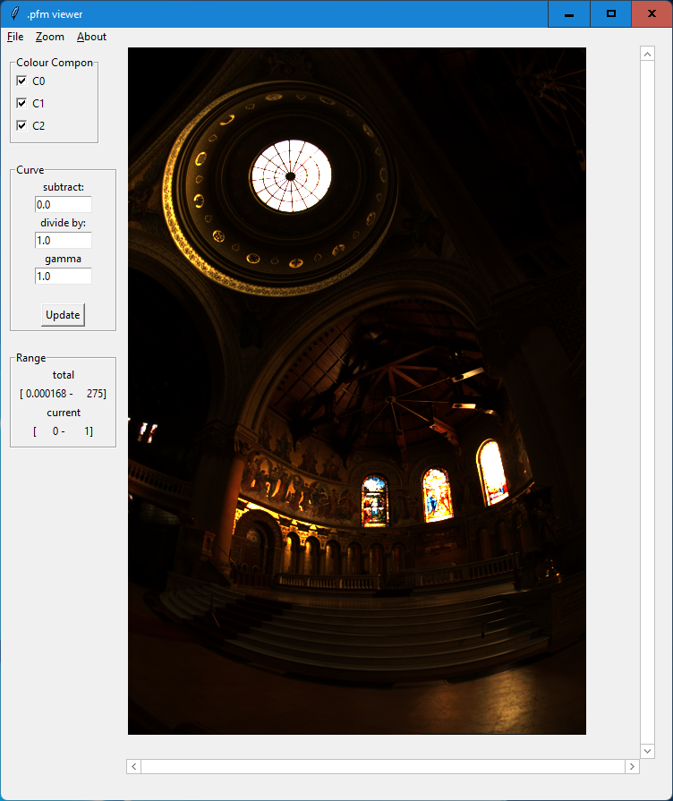
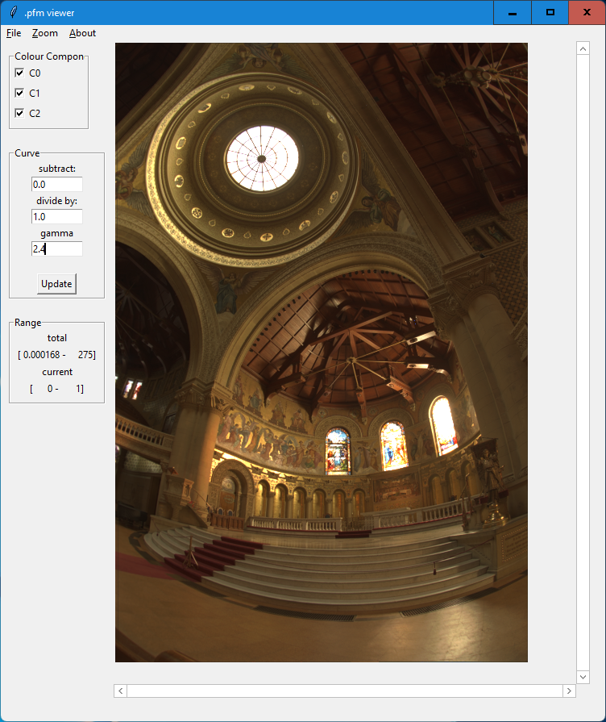
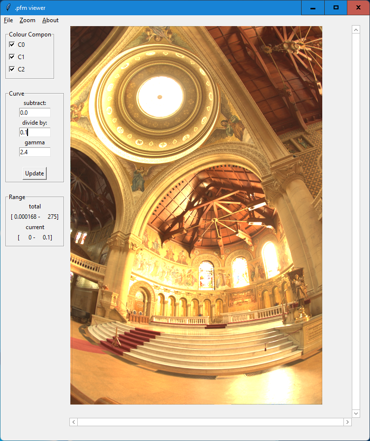
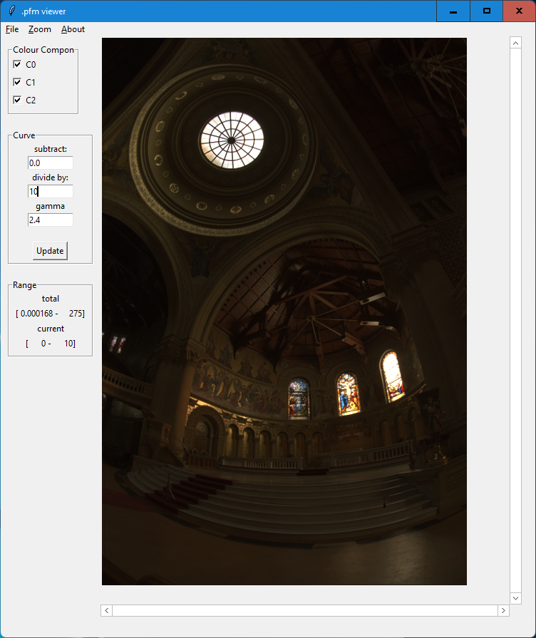

# pfmViewer
pfmViewer is a tool for viewoing .pfm files, where you can make adjustment to 
the image. To be more specific, we give a demo here.

For an image with intensity $I[\mathbf{x}]$, the code employs the following formula
$$ \left( \frac{I[\mathbf{x}] - \text{offset}}{\text{divider}} \right)^{1/\gamma} $$

For this demo, you need the 
[memorial.pfm](http://www.pauldebevec.com/Research/HDR/memorial.pfm)
image from [Paul Debevec](http://www.pauldebevec.com/Research/HDR/PFM/)
webpage.

## Opening the image
This is like any image opening procedure.  The curve fields are: 
The "subtract" field for the $\text{offset}$ variable; the "divider by" field 
for the $\text{divider}$ variable; and the "gamma" field 
for the $\gamma$ variable in the equation above.
After opening the "memorial.pfm" image, you get

## Employ Gamma Correction
The image is in the linear rgb color space.  To display it properly on the
screen, you need to employ Gamma correction; assuming gamma is 2.4, 
$\gamma=2.4$, we get

## Exploring Darker Regions
There are many dark regions in the image, and one may wish to see these more
clearly.  In this case, we need to amplify these values.  This can be achieved
by adjusting the "divide by:" field, as shown in 

## Exploring Brighter Regions
One may also be interested in exploring brighter regions.  In this case,
the "divide by:" field can be set to values larger than 1.0; this can be 
seen in the following image. 

 The rest is self-explanatory.
 
